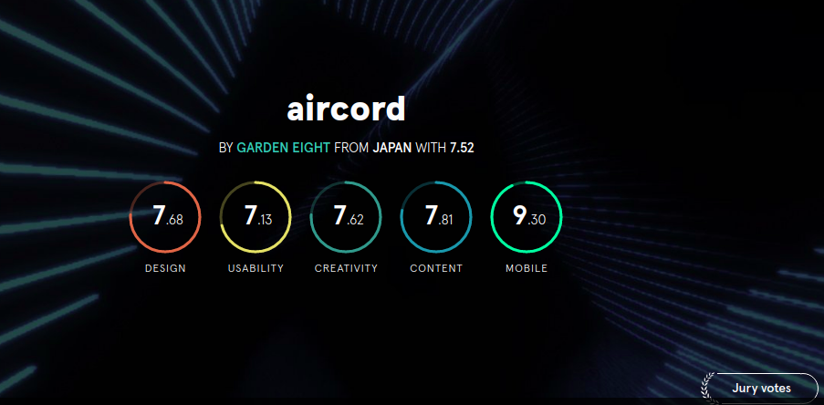

#### Awwards

#### Site
#### Landing Page
Currently deployed at heroku and working.



#### Mobile support
The WebApp is compatible with devices of all sizes and all OS's, and consistent improvements are being made.


#### Get Live link here : [USAGE]()

## Description.
Django CRUD Web application that allows users to signup and login to the web application, they can also follow each other like each other's photos, comment, and update their profiles. It also saves users' posts via various posts and can always be viewed from time to time.


## Running the process
* . virtual/bin/activate
* To open local server run python3 manage.py runserver
* To run the test,run python manage.py test Awwards

## User Story
* A user can view photos that interest me.
* Click on a single photo to expand it and also view the details of the photo.
* Search for different categories of photos. (ie. Nature, Food).
* Copy a link to the photo to share with my friends.
* View photos based on the location they were taken.

## Development Installation
To get the code..

1. Cloning the repository:
  ```bash
  https://github.com/HASSAN1A/Awwards.git
  ```
2. Move to the folder and install requirements
  ```bash
  cd Awwards
  pip install -r requirements.txt
  ```
3. Set up your database
    ```bash
    psql
    ```
4. Running the application
  ```bash
  python manage.py runserver
  ```
5. Testing the application
  ```bash
  python manage.py test pics
  ```
Open the application on your browser `127.0.0.1:8000`.


## Behaviour Driven Development (BDD)

| Behaviour                                                                                        |                                                                      Input                                                                       |                                                                                                 Output |
| ------------------------------------------------------------------------------------------------ | :----------------------------------------------------------------------------------------------------------------------------------------------: | -----------------------------------------------------------------------------------------------------: |
| Page loads, user arrives in the landing page, a list of all available users category is displayed. | The user can click on any particular user or friend suggestions to be directed to a separate page containing user highlights and follow button by the same user. | On clicking the "button" , the user is redirected to friendlist to allow you follow  more users. |  |

## Features

Here are the summary:

- A landing page showing users and their prifile pictures.
- Clickable users which direct the user to a page with their highlights from the particular post.


## Requirements

- This program requires python3.+ (and pip) installed, a guide on how to install python on various platforms can be found [here](https://www.python.org/)

##### Contribution

To fix a bug or enhance an existing module, follow these steps:

- Fork the repo
- Create a new branch (`git checkout -b improve-feature`)
- Make the appropriate changes in the files
- Add changes to reflect the changes made
- Commit your changes (`git commit -am 'Improve feature'`)
- Push to the branch (`git push origin improve-feature`)
- Create a Pull Request

### Bug / Feature Request

If you find a bug (the website couldn't handle the query and / or gave undesired results), kindly open an issue [here](https://github.com/HASSAN1A/Awwards/issues/new) by including your search query and the expected result.
If you'd like to request a new function, feel free to do so by opening an issue [here](https://github.com/HASSAN1A/Awwards). Please include sample queries and their corresponding results.

## Built with

1. [Python 3.8.5](https://www.python.org/doc/) : Programming language.
2. [Django; Python framework used.](https://flask.palletsprojects.com/en/1.1.x/):Framework used.
3. [HTML](https://www.w3schools.com/html/) : Layout.
4. [CSS](https://www.w3schools.com/css/) : Styling.
5. [Bootstrap](https://mdbootstrap.com/) : For responsive websites.
6. [posgreSQL](https://www.postgresql.org/) : Database language.
7. [psycopg2](https://pypi.org/project/psycopg2/) : Database driver.
8. [Javascript](https://www.w3schools.com/js/DEFAULT.asp) : often abbreviated as JS, is a programming language that conforms to the ECMAScript specification.[7] JavaScript is high-level, often just-in-time compiled, and multi-paradigm. It has curly-bracket syntax, dynamic typing, prototype-based object-orientation, and first-class functions.
9. [Google Font API](https://dillinger.io/fonts.google.com) : For prettier fonts Making the web more beautiful, fast, and open through great typography..
10. [Quotes Api](http://quotes.stormconsultancy.co.uk/random.json) : For requesting
11. [Font Awesome](fontawesome.com) : The world's most popular and easiest to use icon set just got an upgrade. More icons. More styles.
12. [jQuery 3](https://jquery.com/) : For special effects.
13. [Figma](https://www.figma.com/file/iTndFXbWHuGkZ1ak60bXr2h/Awwards?node-id=0%3A1) - Blueprint for designing the web app.

## TEAM

[Hassan Juma ](https://github.com/HASSAN1A)


## [License](https://github.com/HASSAN1A/Awwards/blob/master/LICENSE.md)

[MIT](https://github.com/HASSAN1A/Awwards/blob/master/LICENSE.md) © [Hassan Juma](https://github.com/HASSAN1A)
